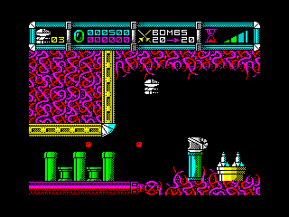
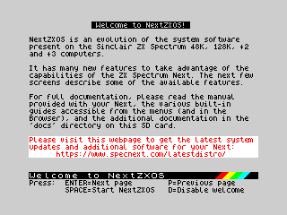
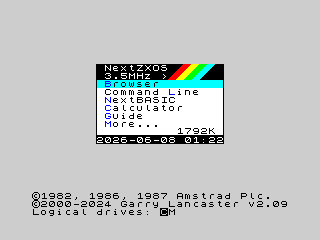
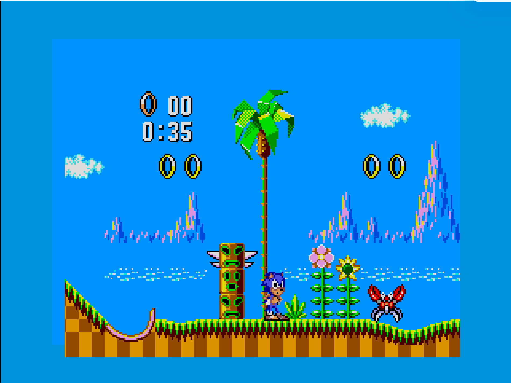
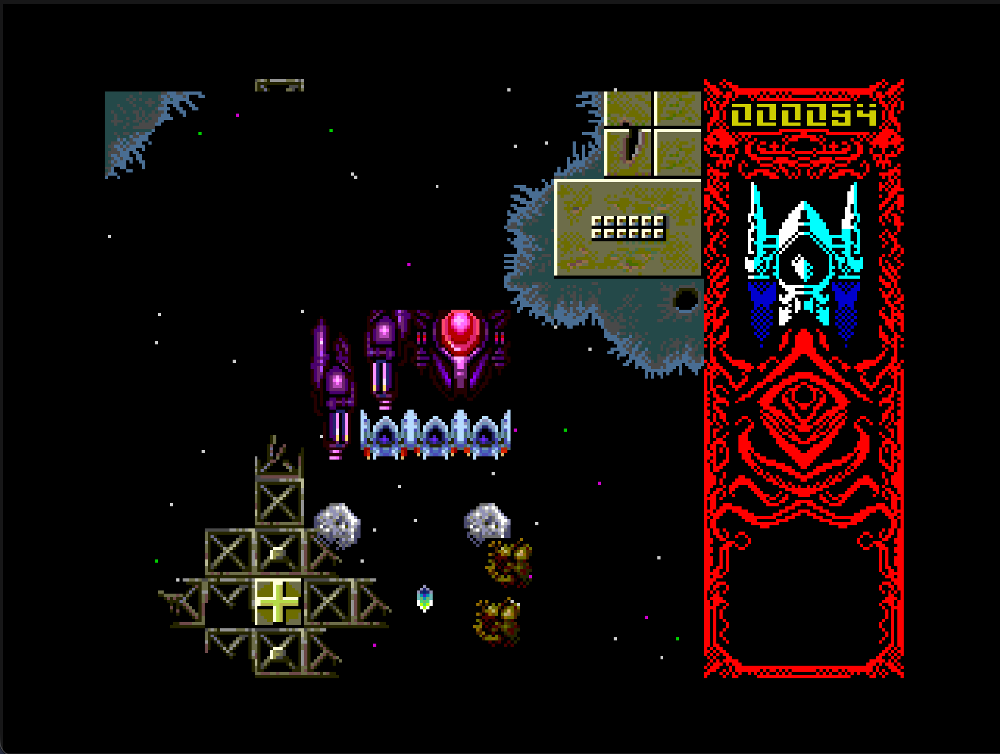
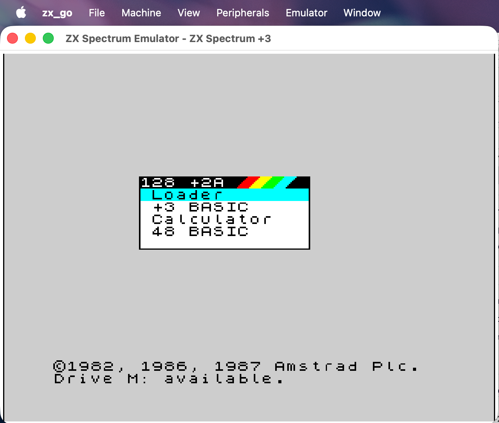
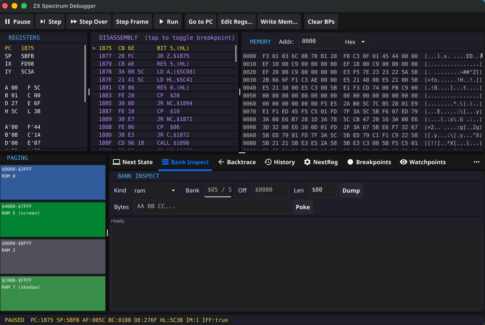

# zx_go

**A faithful emulator for the entire Sinclair 8-bit line — the ZX80, the ZX81, every classic ZX Spectrum (48K, 128K, +2, +2A, +3), the Pentagon clone, and a from-the-silicon-up ZX Spectrum Next — written in Go.**

[](LICENSE)
[](https://go.dev)
[](#installation)
[](https://github.com/conorarmstrong/zx_go/releases)

| Cybernoid (+3) | NextZXOS welcome | NextZXOS menu |
| :---: | :---: | :---: |
|  |  |  |

| Sonic the Hedgehog (Next) | Warhawk (Next) |
| :---: | :---: |
|  |  |

zx_go runs the whole family on one codebase, from the 1980 ZX80 to the 2017 Spectrum Next. Classic models are cycle-accurate with full memory and port contention; the **Spectrum Next cold-boots real NextZXOS through the authentic FPGA boot chain** — no snapshots, no shortcuts — to a fully interactive desktop, with a deep custom-hardware stack emulated.

The 48K was the author's first computer; this began as a Go learning exercise and turned into a serious emulator.

> ### Honest status
>
> - **Classic line (ZX80 → +3, Pentagon, SAM Coupé): mature and stable.** Cycle-accurate Z80 (passes both Cringle `zexdoc`/`zexall` exercisers), full contention, every documented format. These are the solid, day-to-day-usable part of zx_go.
> - **Spectrum Next: faithful boot, young *game* compatibility.** NextZXOS cold-boots end-to-end and the individual hardware blocks are extensively tested against the FPGA VHDL, but **running arbitrary `.NEX` games is the newest and least-finished area.** A growing set of titles are playable (e.g. Sonic), several render but still have bugs, and many have not been verified at all. If a Next game misbehaves for you, that's expected at this stage — please [open an issue](https://github.com/conorarmstrong/zx_go/issues); a comparison against real hardware is exactly what moves it forward.
>
> The per-title manifest, with tested-on-hardware statuses and known issues, is in **[docs/compatibility.md](docs/compatibility.md)**. Feature claims below describe *implemented and tested hardware blocks*; they are not a promise that every title exercising them runs perfectly.

---

## Highlights

- 🖥️ **The whole family, one emulator** — ZX80 · ZX81 · Spectrum 48K · 128K · +2 · +2A · +3 · Pentagon 128 · **Spectrum Next** · **SAM Coupé**.
- ⚡ **The Next, done properly** — authentic cold boot to NextZXOS, Layer 2 (incl. 320×256 / 640×256 hi-res), 128 hardware sprites with collision, tilemap, Copper, the full NextReg file, 8K MMU, DivMMC/esxDOS, Turbosound, DACs, RTC, and all four clocks up to 28 MHz.
- 💾 **Every common format** — snapshots (`.sna`/`.z80`/`.szx`), tapes (`.tap`/`.tzx`), six disk formats, TR-DOS `.trd`, microdrive `.mdr`, `.NEX`, and RZX recordings.
- 🎛️ **Period-accurate peripherals** — +3 FDC, Beta Disk, Interface 1 & 2, DISCiPLE, Multiface 1/128/3, Kempston mouse, ZX Printer, every joystick scheme.
- 🔊 **Real sound** — ULA beeper, AY-3-8912 / Turbosound, SpecDrum & Covox DACs, the Next 4-channel DAC, measured AY volume curve.
- 🐞 **Three debuggers, one live backend** — a visual GUI, a scriptable telnet server, and headless trace instrumentation, all sharing the same breakpoints, watchpoints, and time-travel ring.

---

## Quick start

```bash
# Requires Go 1.25+ and a C toolchain (Fyne uses cgo for the OS window layer)
git clone https://github.com/conorarmstrong/zx_go
cd zx_go
go build -o bin/zx_go ./cmd/zx_go
./bin/zx_go
```

Then:

- **Snapshot:** `File → Open File…` and pick a `.sna` / `.z80` / `.szx` — it just runs.
- **Tape:** `File → Open File…`, pick a `.tap` / `.tzx`, then type `LOAD ""` (or press `J`, `"`, `"`, Enter) in 48K BASIC.
- **Spectrum Next:** `Machine → ZX Spectrum Next` and accept the one-time ROM download. See [The Spectrum Next](#the-spectrum-next).

Prefer not to build? Grab a [pre-built binary](#installation).

---

## Contents

- [Highlights](#highlights)
- [Quick start](#quick-start)
- [Supported machines](#supported-machines)
- [File formats](#file-formats)
- [Sound & peripherals](#sound--peripherals)
- [The Spectrum Next](#the-spectrum-next)
- [Installation](#installation)
- [Using zx_go](#using-zx_go)
- [Debugging & headless tooling](#debugging--headless-tooling)
- [How it compares](#how-it-compares)
- [Documentation](#documentation)
- [Project layout](#project-layout)
- [License](#license)

---

## Supported machines

| Machine | Status | Notes |
| --- | --- | --- |
| **ZX80 / ZX81** | ✅ Interactive | Faithful **CPU-generated display** (NOP-on-the-bus video, R-register INT, ZX81 SLOW-mode NMI border), native per-machine keyword keyboard, `.P`/`.O` loading. `--zx81` / `--zx80`. |
| **Spectrum 48K** | ✅ Interactive | The original. Cycle-accurate, contended. Interface 1 microdrive option. |
| **Spectrum 128K / +2** | ✅ Interactive | AY sound, 128 KB paged memory, the 128 menu. |
| **Spectrum +2A / +3** | ✅ Interactive | `$1FFD` 4-ROM paging; the +3 adds the integrated μPD765A FDC and disks. |
| **Pentagon 128** | ✅ Interactive | Soviet clone: 128K + AY, **no contention**, 71680-T frame, TR-DOS `.trd` via the Beta Disk interface. `--pentagon`. |
| **ZX Spectrum Next** | ✅ Cold-boots NextZXOS | Real FPGA boot chain → NextZXOS desktop; full custom hardware. See [below](#the-spectrum-next). |
| **SAM Coupé** | ✅ Interactive | MGT's 1989 Z80B machine: custom ASIC (4 screen modes, 128-colour palette, bordered display), 256/512K paging, SAA1099 sound, WD1772 floppy — **real disk games boot** (File → Load SAM Disk, then `BOOT`). Cold-boots the bundled MGT ROM 3.0 to SAM BASIC. `--sam`. See [docs/sam-coupe.md](docs/sam-coupe.md). |

Classic timing is cycle-accurate with memory **and** port contention; the +3/+2A 4-ROM paging, all tape formats, and all six disk formats are supported. Switch models any time from the **Machine** menu (state is cold-wiped).

---

## File formats

| Format | Extensions | Load | Save | Notes |
| --- | --- | :---: | :---: | --- |
| Snapshots | `.sna` `.z80` `.szx` | ✓ | ✓ | Full 48K + 128K |
| Tape | `.tap` `.tzx` | ✓ | ✓ | TZX save covers blocks 0x10/0x11/0x14 |
| Disk (+3) | `.dsk` `.edsk` | ✓ | ✓ | EDSK handles weak sectors |
| Disk (other) | `.udi` `.mgt` `.img` `.sad` `.d40` `.d80` | ✓ | — | Full format coverage |
| TR-DOS / Beta | `.trd` | ✓ | — | Pentagon / 48K / 128K via WD1793 |
| Microdrive | `.mdr` | ✓ | ✓ | Sinclair cartridge format |
| Interface 2 cartridge | `.rom` | ✓ | — | 16 KB, 48K-only |
| RZX recordings | `.rzx` | ✓ | ✓ | Per-frame insn count + IN stream |
| Spectrum Next | `.nex` | ✓ | — | v1.2 loader: banks, palette, Copper |
| ZX81 / ZX80 program | `.p` `.81` / `.o` `.80` | ✓ | — | Raw dump, loads into ZX8x mode |
| Audio capture | `.wav` | — | ✓ | Record emulator output |
| Screenshot | `.png` | — | ✓ | Any model / Next video mode |

`File → Open File…` sniffs the file's magic and dispatches to the right loader — you rarely need the format-specific menu items.

---

## Sound & peripherals

**Sound:** ULA beeper · AY-3-8912 (128K+, correct `$BFFD`/`$FFFD` decode) · Turbosound (three AY chips on the Next) · SpecDrum & Covox 8-bit DACs (ports `$DF`/`$FB`, opt-in) · Next 4-channel DAC — all event-timed and mixed sample-accurately.

**Peripherals:**

- **+3 FDC** — NEC μPD765A, two drives, full command set.
- **Beta Disk / TR-DOS** — WD1793 with auto-paging TR-DOS ROM.
- **Interface 1 + Microdrive** — 8 daisy-chained drives, GAP/SYNC formatting.
- **Interface 2** — cartridge slot / ROM override.
- **DISCiPLE** — MGT interface with GDOS ROM.
- **Multiface 1 / 128 / 3** — NMI button (F12) and ROM paging.
- **Kempston mouse** — X / Y / buttons.
- **ZX Printer** — 1-bit thermal printer with PNG export.
- **Joysticks** — Kempston (`$1F`), Sinclair Interface 2 left/right, Cursor/Protek.

---

## The Spectrum Next

Most emulators treat the Next as a fast 128K with extra registers. **zx_go emulates the real thing** — it is the most active area of the codebase.



**Authentic cold boot.** `./bin/zx_go --next` runs the genuine chain with no captured-state replay: FPGA bootrom splash → TBBLUE firmware → NextZXOS welcome → main menu. The **Browser** lists your SD card's `C:/`, **NextBASIC** runs interactively (type, `RUN`, `BREAK`), **128K BASIC** opens the real Sinclair "128" menu pixel-for-pixel, and pressing SPACE at the splash gives the firmware **config menu** that boots any machine personality.

**The full custom hardware:**

- **Layer 2** — 256×192 plus the **320×256 / 640×256 hi-res modes**, per-pixel priority, hardware scrolling, 256-colour and 9-bit (4096-colour) palettes.
- **128 hardware sprites** — 4bpp & 8bpp, scaling, mirror/rotate, relative/anchor groups, `$303B` collision detection.
- **Tilemap + Copper** — 40×32 / 80×32 tilemap with text mode and per-tile scroll/clip/mirror/rotate; a raster-precise Copper co-processor.
- **The full NextReg file** (audited against the FPGA core) + the **8K MMU** and **all four clocks (3.5 / 7 / 14 / 28 MHz)** with contention scaling.
- **Storage** — DivMMC + esxDOS, SD-card / FAT image *or* a host-folder mount, plus zxnDMA, UART, Multiface 3, and a battery-backed i2c RTC.
- **`.NEX` games** load through NextZXOS's own loader from `File → Open File…`. Compatibility is **young**: some titles (e.g. Sonic) are playable, others render with bugs, and many are unverified — see the [status note](#honest-status) and the [compatibility manifest](docs/compatibility.md).

### Setup

The classic modes need nothing — their ROMs are embedded. The Next needs two **licensed** ROMs (`enNextZX.rom`, `enNxtmmc.rom`) that can't be bundled, plus SD-card content.

**The easy way:** pick **Machine → ZX Spectrum Next**. If the ROMs aren't installed, zx_go offers to **download them for you** from the official [Spectrum Next distribution](https://www.specnext.com/latestdistro/), installs the SD content, and boots straight in. The GPLv3 FPGA loader (`tbblue_loader.rom`) ships embedded, so there's nothing else to fetch.

> ⚠️ **Version match:** install the Next ROMs from the **same distro** as your SD-card content — NextZXOS traps on a version mismatch. The install dialog cross-checks and warns you.

Manual install, pointing at an SD card or `.img`, persistence (`--sd-writeback`), and the full boot/troubleshooting story are in **[docs/spectrum-next.md](docs/spectrum-next.md)**.

---

## Installation

### Pre-built binaries

Grab the latest from the [Releases](https://github.com/conorarmstrong/zx_go/releases) page:

| Platform | Download |
| --- | --- |
| macOS (Apple Silicon) | `zx_go-macos-arm64.tar.gz` |
| macOS (Intel) | `zx_go-macos-amd64.tar.gz` |
| Windows | `zx_go-windows-amd64.exe.zip` |
| Linux | `zx_go-linux-amd64.tar.gz` |

On macOS/Linux: `tar xzf zx_go-macos-arm64.tar.gz && ./zx_go-macos-arm64`. On Windows: unzip and double-click the `.exe`.

The classic ROMs (48K → +3, plus the DISCiPLE / Multiface / Interface 1 peripheral ROMs) are **embedded in the binary** — nothing to install for those modes.

### Building from source

You need **Go 1.25+**, a C compiler (`cc`/`gcc`/`clang` — Fyne uses cgo), and OpenGL libraries (system-provided on macOS and most Linux; trivial on Windows).

```bash
git clone https://github.com/conorarmstrong/zx_go
cd zx_go
go build -o bin/zx_go ./cmd/zx_go
./bin/zx_go

# Run the tests (~90s, forty-plus packages)
go test ./...
```

---

## Using zx_go

Everything classic just works — pick a model from **Machine**, and load software from **File → Open File…**. For a guided tour of every day-to-day task — choosing a machine, loading tapes/snapshots/disks, quick save/load (**F2**/**F4**), peripherals, sound, the keyboard, and troubleshooting — read the **[user manual](docs/manual.md)**.

### Keyboard, joystick & mouse (essentials)

| Spectrum | Host |
| --- | --- |
| CAPS SHIFT | Left Shift |
| SYMBOL SHIFT | Right Shift / Ctrl / Alt / ⌘ |
| Arrow keys | Arrows (CAPS SHIFT + 5/6/7/8) |
| DELETE | Backspace |
| BREAK | F11 |
| NMI / Multiface | F12 |
| Quick save / load | F2 / F4 |

Pick a joystick scheme from **Peripherals → Joystick** (Kempston, Sinclair left/right, Cursor/Protek); enable **Peripherals → Kempston Mouse** for mouse support. Keymaps are editable and persist in `config.json`. The full menu reference and key tables are in the [manual](docs/manual.md).

**Playing a joystick game** (e.g. a Spectrum Next `.nex` such as Sonic): move with the **arrow keys**, fire/jump with **Right‑Alt** or **Right‑Ctrl**. The Next always has a built‑in Kempston joystick, so on the Next the arrow keys drive it out of the box — you don't need to pick a scheme. (A game's own *title menu* may use its own keys; once in‑game, the arrows + Right‑Alt are your controls.)

---

## Debugging & headless tooling

zx_go ships **three** ways to inspect a running machine, all sharing **one live backend** — a breakpoint set over telnet fires in the GUI's gutter, and the register-watchpoint / time-travel / M1-history state is shared across all surfaces.



- **Visual debugger** (`Emulator → Debugger`) — live registers, full Z80 + Z80N disassembly (click a line to toggle a breakpoint), 64 KB hex view, paging diagram, and tabbed tools: Next State, Bank Inspect, Backtrace, M1 history & heatmap, NextReg, conditional/bank-filtered breakpoints, register watchpoints, time-travel, and — on the Next — live Palette / Sprites / Layer 2 / Tilemap inspectors.
- **Telnet debugger** — a ZRCP-style line server (`--debugger-port=N`) you drive from `nc` / `telnet` / scripts. Bank-aware breakpoints, watchpoints, tracepoints, heatmaps, time-travel, provenance.
- **Headless instrumentation** — `--headless` with trace channels, periodic state snapshots, memory-write watchpoints, bank-switch / SD logging, PC triggers, and a loop/stall detector.

A few examples:

```bash
# Boot straight into a file — the extension picks the machine:
# .tap/.tzx auto-type LOAD, .nex boots the Next, .trd the Pentagon,
# snapshots restore their own model. Works headless too. An explicit
# model flag (--pentagon game.tap) beats the extension.
./bin/zx_go game.tap
./bin/zx_go --headless --frames=2500 --save-screen=/tmp/run.png game.nex

# File-manager double-click integration (per-user, Linux/XDG):
./desktop/install-desktop.sh   # see desktop/README.md

# Boot the Next headless and capture the framebuffer
./bin/zx_go --next --headless --frames=3000 --save-screen=/tmp/boot.png

# Mount and play a tape headless (then drive LOAD"" with --press-key, or use
# the 128 Tape Loader on a 128K model)
./bin/zx_go --headless --tape game.tap --frames=5000 --save-screen=/tmp/tape.png

# Open the scriptable telnet debugger, paused at reset
./bin/zx_go --next --headless --debugger-port=10000 --debugger-pause-at-start

# One-shot state dump (CPU + MMU + NextRegs + sysvars + screen) after 300 frames
./bin/zx_go --next --headless --dump-state=300
```

Every flag is in `./bin/zx_go --help`. The complete debugger guide — every visual tool, the full telnet command reference, worked examples, and the headless diagnostics — is in **[DEBUGGER.md](DEBUGGER.md)**.

---

## How it compares

Wondering how zx_go stacks up against **CSpect**, **ZEsarUX**, and **MAME** (`tbblue`)? **[COMPARISON.md](COMPARISON.md)** has a fair, criterion-by-criterion table — licensing, platforms, Next hardware coverage, CPU/timing accuracy, media, peripherals, audio, and debugging — with sources and honest caveats about where zx_go is young and where the others lead.

---

## Documentation

| Doc | What's in it |
| --- | --- |
| [Architecture docs](docs/architecture/README.md) | Developer documentation: architecture, code organisation, implementation patterns, chip emulation, the Next FPGA internals, known gaps — with Draw.io diagrams. |
| [User manual](docs/manual.md) | Day-to-day use: machines, loading, saving, peripherals, sound, shortcuts, troubleshooting. |
| [Spectrum Next](docs/spectrum-next.md) | ROM install, SD-card setup, boot status, `.NEX`, licensing. |
| [ZX80 / ZX81](docs/zx80-zx81.md) | The CPU-generated-display machines in detail. |
| [SAM Coupé](docs/sam-coupe.md) | The MGT SAM Coupé: modes, sound, disk, status. |
| [Debuggers](DEBUGGER.md) | Full visual + telnet + headless reference. |
| [Compatibility](docs/compatibility.md) | The tested-title manifest and how class evidence works. |
| [Comparison](COMPARISON.md) | vs. other Spectrum Next emulators. |

---

## Project layout

```
cmd/zx_go/        GUI (Fyne) + headless CLI entry point
pkg/
  z80/            Z80 + Z80N CPU core
  ula/            Display, border, audio, tape I/O, port dispatch
  memory/         Bank paging, contention, FPGA bootrom
  keyboard/  audio/  ay/         Input + beeper + AY sound
  snapshot/  rzx/                SNA/Z80/SZX + RZX recording
  plus3fdc/  microdrive/  if1/  if2/   Disk, microdrive, interfaces
  kempmouse/  zxprinter/          Mouse + printer
  peripherals/  disciple/  multiface/  Peripheral manager + devices
  next/           Spectrum Next: nextregs, divmmc, esxdos, sdcard,
                  layer2, palette, sprite, copper, dma, dac, rtc,
                  uart, nex, compositor, install
  debugger/       Visual debugger backend
  testharness/    Headless scripted emulator (40+ integration tests)
  roms/  config/  trace/  zxlog/   ROMs, settings, tracing, logging
docs/             Per-subsystem documentation
LICENSES/         GPLv3 text + NOTICE for the embedded tbblue_loader.rom
```

---

## License

**GPLv3 as a whole** — see [LICENSE](LICENSE). Upstream [zx_go](https://github.com/conorarmstrong/zx_go) is **MIT**; the modifications and additions made in this repository are **GPLv3**, so this modified tree is distributed under GPLv3. The bundled FPGA loader (`pkg/roms/data/tbblue_loader.rom`, embedded) is also **GPLv3**; see [`LICENSES/tbblue_loader-NOTICE.md`](LICENSES/tbblue_loader-NOTICE.md). The NextZXOS system ROMs are licensed (Amstrad/Sky) and are **not** bundled — they're downloaded on first run.
